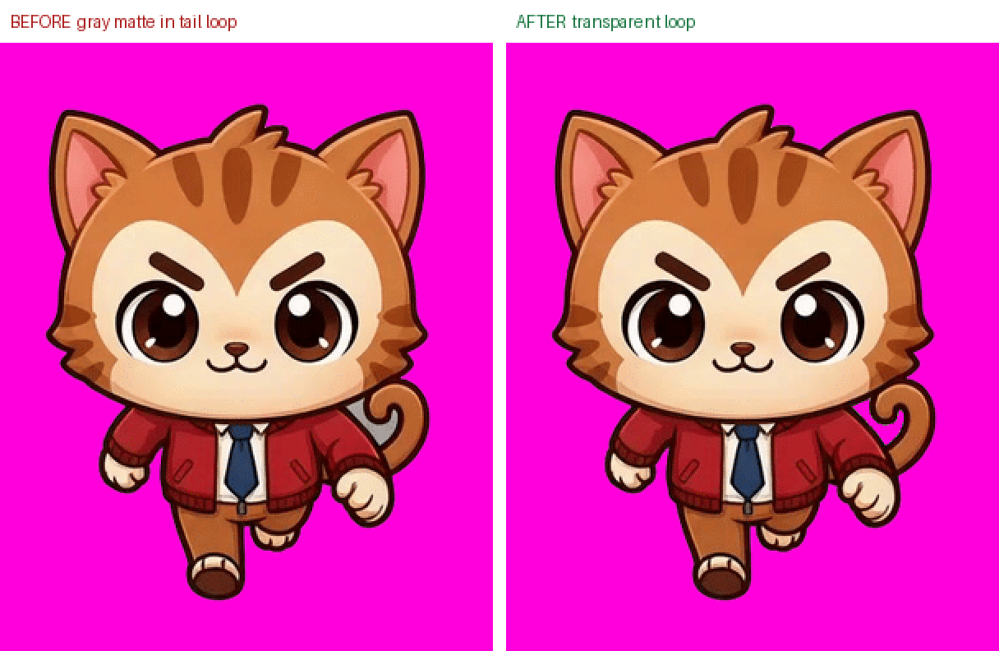

# Sprite Pocket Cleaner

Remove the **opaque background that survives inside a sprite's enclosed holes** — the white,
gray, or coloured matte blob under a raised arm, in an armpit, between the legs, or in the
crevice of a paw.

You mark the pockets by clicking them in a browser page; a Python script does the pixel work.



*The bundled sample is Office Cat, a real production sprite sheet. The pale-gray patch inside the
tail curl is leftover source matte: the track should show through that enclosed loop. One
reviewed mark clears it while the face, eyes, shirt, cuffs, paws, and highlights remain
untouched. Regenerate this comparison with `python3 sample/make_before_after.py`.*

---

## The problem

Background removal — whether a generator's, an artist's magic wand, or a chroma key — floods
in **from the outside** of the drawing. It only reaches what the silhouette lets it reach. A
hole *enclosed* by the character is never visited, so the original backdrop survives there as
fully opaque pixels. At game size that reads as a white blob stuck to the character.

## Why this isn't a one-liner

The obvious fix — "delete the white pixels" — destroys the art. Common examples include:

| what is white on a sprite sheet | example |
|---|---|
| eyes and eye whites | every character |
| round eye highlights | can be shape-identical to a small pocket |
| teeth | most open-mouth frames |
| a third of the **body** | any white/pale character |
| the actual defect | the pocket you want gone |

Experiments with automatic colour and outline thresholds produce eye/highlight false positives.
There is no dependable threshold that separates them for arbitrary art. So this tool **does not
guess** — you mark, it executes. `--scan` prints candidates as hints, and says outright that
most will be eyes.

## Install

No build step. The UI is one dependency-free HTML file; the applier is one Python script.

```bash
# Optional but recommended: keep dependencies isolated.
python3 -m venv .venv
source .venv/bin/activate
python3 -m pip install -r requirements.txt      # pillow, numpy, scipy
```

Tested on Python 3.13 / Pillow 12.3 / numpy 2.5 / scipy 1.18. `node` is optional — only for
`--parity` (see [Tests](#tests)), which skips cleanly without it.

## Quickstart — on the bundled sample

`sample/sample_sheet.png` is the real 25-frame Office Cat walk sheet exported from its source
project.
Its companion `.png.meta` supplies the 25 tight frame rectangles. Several frames retain an
opaque warm-gray source matte inside the curled tail. The pale face, white shirt, cuffs, paws,
eyes, and highlights are legitimate artwork and must survive.

Frame 0 has a clear pocket. Because its matte is gray rather than bright white, the command-line
guard requires the deliberate `--any-colour` opt-in. Always review this broader permission in a
dry run first:

```bash
python3 sprite_pocket_cleaner.py sample/sample_sheet.png --at 330,305 --any-colour --dry-run
```

```
sample/sample_sheet.png  25 frame(s), 1 mark(s), indexed (kept)

  mark 0: seed RGB (178, 168, 164), tolerance 30
     fr  0 |    244px | (330,305)

  preview (before|after) -> sample/.sprite-pocket-cleaner-preview/sample_sheet.png

  dry run - nothing written (1 frame(s), 244px would be erased)
```

The preview shows the diagnostic magenta background through the tail loop and no change to
nearby fur, outline, clothing, or face. The remaining dirty tail loops are intentional practice
targets: mark them in the browser and review propagation before exporting a plan. The bundled
sheet itself stays dirty; `sample/make_before_after.py` runs the real applier on a temporary
copy.

## Normal workflow

**1. Mark.** Open `sprite_pocket_cleaner.html` in a browser — straight from disk, no server:

```bash
open sprite_pocket_cleaner.html          # or xdg-open / just double-click it
```

Drop the sheet `.png` **and its `.png.meta`** on the page (either order). The `.meta` supplies
the frame rects; without it the sheet is one frame and nothing propagates.

| action | does |
|---|---|
| click a leftover matte pocket | marks it and previews the fill; enable propagation first to preview nearby matches in other frames |
| shift-drag | rectangle mark — for a fringe a flood fill won't hold |
| wheel / drag | zoom / pan |
| **Fit & centre**, or `F` | resets pan+zoom when you've lost the sheet off screen |
| `−` / `%` field / `+` | zoom out/in, or type an exact percentage |
| **show erased in colour** | paints what would be removed instead of hiding it; choose a preview colour that contrasts with the sprite |
| Undo / Clear / ✕ | drop last mark / all marks / one mark |
| **Download plan.json** | export the seed points |

**2. Apply.**

```bash
python3 sprite_pocket_cleaner.py --plan ~/Downloads/plan.json --dry-run
python3 sprite_pocket_cleaner.py --plan ~/Downloads/plan.json
```

The page **writes no pixels** — it only records where you clicked. The Python script replays
the same fill and owns every byte that reaches the PNG.

**Without the browser**, marks can be given directly (sheet pixel coordinates, top-left origin):

```bash
python3 sprite_pocket_cleaner.py <sheet.png> --at 812,431 --at 900,455
python3 sprite_pocket_cleaner.py <sheet.png> --rect 205,300,25,35
python3 sprite_pocket_cleaner.py --scan <folder>          # hints; reads only
```

## Gray and coloured leftovers

The flood fill is not limited to white: it uses the colour of the pixel you mark. In the page,
turn on **allow dark / coloured matte for new marks** before clicking a gray or coloured
leftover, then inspect the red preview and export the plan. The override is saved only on those
marks, so a normal mark is still refused if its seed looks like fur, clothing, an eye, or other
artwork. The tool cannot infer that distinction automatically: manually choosing the target and
checking the preview is the safety boundary.

For command-line-only use, `--any-colour` permits such seeds for that run; use it only with a
`--dry-run` preview first.

## Erase, or fill?

The one judgement call the tool can't make for you:

* a gap that **opens to the outside** (an armpit, between the legs) is real background —
  **erase it**, the default;
* a pocket **fully encircled** by the drawing becomes a slit you can see the background
  through — **`--paint`** keeps the alpha and replaces only the colour with the nearest
  surviving one, which on a pocket ringed by outline reads as a shadowed crease.

The tool reports which kind each region is, and the preview composites over magenta so a hole
is obvious. A useful tell: if the same crevice is *already transparent on other frames*, the
white is leftover background and erasing is right.

## What it does to the pixels

The fill is **4-connected**, takes pixels whose **every channel is within `--tolerance` of the
seed colour**, stops at anything already transparent, and never crosses a frame rect. Then:

* the region's alpha goes to **0**;
* a **`--feather`** band around it gets partial alpha scaled by how close each pixel still is
  to the seed colour — this takes the antialiased fringe between the pocket and the outline,
  instead of leaving a halo;
* erased and feathered pixels get their **RGB replaced by the nearest surviving colour** (edge
  padding), so bilinear filtering and mipmaps can't bleed white back in at any draw size.

**Geometry is untouched.** No pixel moves, no frame rect is rewritten. The tool checks each
edited frame's drawn bounding box and warns in the one case where that isn't true (the pocket
reached the silhouette edge).

**An indexed (mode "P") PNG stays indexed** — only changed pixels are re-indexed against the
sheet's own palette, so a 917 KB sheet doesn't come back as 3 MB RGBA. `--rgba` forces the
conversion; it also happens automatically if the palette has no transparent entry.

**Propagation.** A pose barely moves inside a loop, so a mark is mapped into every other frame
through the `.meta` rects. It seeds from the marked region's **brightest** colour (not the pixel
you happened to click, often a dim edge one), tries every candidate within `--search` px, and
keeps the **largest** region no more than 4× the one you marked. Smaller is expected — a pocket
opens and closes over a loop.

## Options

| flag | default | for |
|---|---|---|
| `--plan FILE` | — | plan.json exported by the UI |
| `--at X,Y` | — | mark by seed pixel; repeatable |
| `--rect X,Y,W,H` | — | erase matching pixels inside a rectangle only; repeatable |
| `--tolerance N` | 30 | max per-channel difference from the seed |
| `--feather N` | 2 | partial-alpha ramp around the region; `0` = hard edge |
| `--search N` | 10 | how far a propagated mark may hunt in another frame |
| `--max-area F` | 0.15 | refuse a fill covering more than this share of the frame's drawn pixels |
| `--paint` | off | fill with the surrounding colour instead of erasing |
| `--propagate` | off | propagate direct CLI marks; review every resulting region in the dry-run preview |
| `--no-propagate` | off | override a plan and edit only the frame each mark sits in |
| `--rgba` | off | write RGBA even for an indexed source |
| `--any-colour` | off | allow dark/saturated seeds for the whole run; the UI can save this permission per mark instead |
| `--dry-run` | off | report + preview only |
| `--restore` | — | copy the sheet back from `.art-backup/` |
| `--scan FOLDER` | — | list light enclosed blobs as hints; reads only |
| `--self-test`, `--parity` | — | see below |

## Refusals

| message | why | do |
|---|---|---|
| `not background-like` | seed is dark or saturated — usually a misclick on art | mark it in the UI with **allow dark / coloured matte**, or use `--any-colour` after a dry run |
| `REFUSED … % of the drawn frame` | fill exceeded `--max-area` — it leaked | lower `--tolerance`, or use `--rect` |
| `<<< N% of the drawn frame` | under the cap but larger than a pocket should be | check the preview |
| `too big, mark it by hand` | a propagated region is >4× the mark | mark that frame separately |
| `no pocket there` | nothing matching within `--search` px | normal — it isn't on that frame |
| `already transparent - skipped` | re-running on a fixed sheet | nothing; it's idempotent |

## Output and undo

Every run writes a before/after contact sheet — **cropped to what actually changed** — beside
the source PNG in `.sprite-pocket-cleaner-preview/`. These edits are often a few dozen pixels,
so crops are scaled up as well as down.

The original is copied to `.art-backup/` beside the sheet before anything is written, and never
overwritten by a later run, so it stays the most original copy. `--restore` puts it back — and
if that backup predates other edits, the tool says so with a pixel count rather than letting
you discover it.

## Tests

```bash
python3 sprite_pocket_cleaner.py --self-test   # 17 checks, touches no files
python3 sprite_pocket_cleaner.py --parity      # UI == tool (needs node; skips without it)
python3 -m unittest discover -s tests         # plan permissions + gray-matte safety
```

`--self-test` runs synthetic sheets containing a pocket *and* an eye, pinning the behaviours
this tool has actually got wrong: the fill must not reach the eye or leave the frame, erased
pixels must lose their white RGB, a pocket that shrinks 7× across frames must still propagate,
and a region several times bigger than the mark must be refused.

The standalone unit tests additionally pin the dark/coloured-matte permission: it is opt-in on
one plan mark, a gray pocket can be erased, and a separate same-coloured eye remains unchanged.

**`--parity` is the important one.** The page and the script are two implementations of one
fill, and they drifted apart once — a seed-search fix landed in the Python and not the JS,
which would have previewed a clean result while the PNG kept its pocket. `--parity` loads the
**shipped page's own script** out of the HTML, runs it over the same pixels, and fails if the
answers differ. Run it after touching either side.

## Files

| path | what |
|---|---|
| `sprite_pocket_cleaner.html` | the marking UI — one file, no dependencies |
| `sprite_pocket_cleaner.py` | applies a plan; owns every byte written to a PNG |
| `sprite_pocket_cleaner_parity.js` | runs the page's own JS for `--parity` |
| `sample/` | real Office Cat sheet + `.meta`, provenance note, and the README-image generator |
| `.sprite-pocket-cleaner-preview/` | generated before/after contact sheets beside source PNGs |
| `.art-backup/` | originals |

## Provenance

Built to clean AI-generated character sheets. It can read Unity `.png.meta` files for frame
rects, but any PNG path works; Unity is optional. The bundled Office Cat sheet is a privately
owned game-art fixture included by the asset owner so the quickstart demonstrates a genuine
generative-art defect. It is not offered as reusable stock art, and the repository's
Apache-2.0 software licence should not be read as a separate licence to the sprite. See
`NOTICE` and `sample/README.md`.

See `SPEC.md` for the supported behaviour, safety invariants, and change process.
